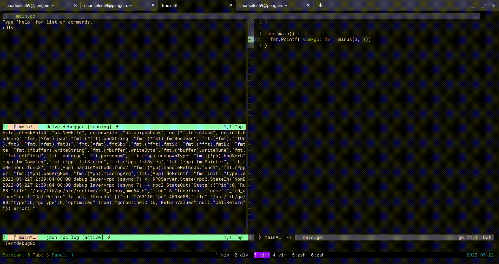

termdebug-go
============

The geeks's debugger tool for goers.

This plugin is inspired [termdebug.vim](https://github.com/vim/vim/blob/master/runtime/pack/dist/opt/termdebug/plugin/termdebug.vim).

[delve](https://github.com/go-delve/delve) frontend for golang.

# TODO:
- restore state after exit
1. save breakpoints
2. show local variables
3. show backtrace
4. show logs
